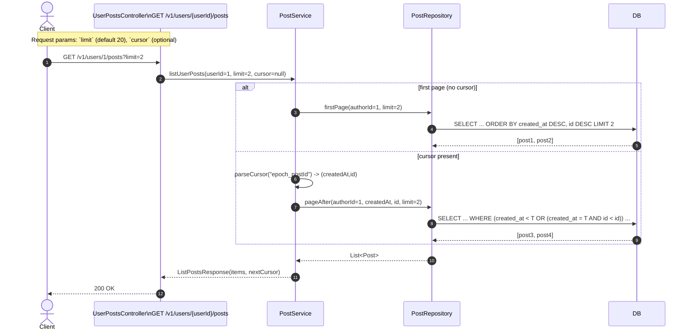
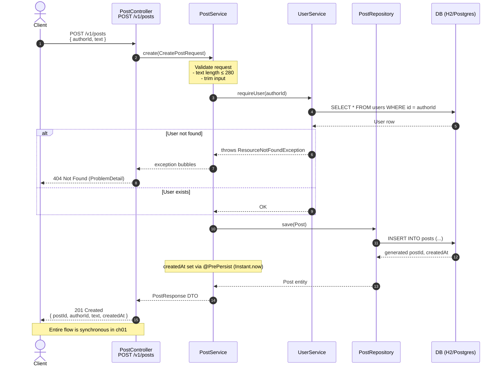

# Chapter 01 — Scale Basics (Reads \& Pagination)

This chapter explains how to make the existing Pulse design scale-aware for read paths, focusing on safe pagination, deterministic ordering, and indexing. Asynchronous processing and events are intentionally omitted.

---

## Context

At the end of `ch00-baseline`, Pulse supported:

- Creating users
- Creating posts
- Listing posts for a user

All operations were synchronous and simple — appropriate for an early-stage system. However, read-heavy endpoints tend to break before write-heavy ones as scale increases. This chapter addresses that problem.

---

## The problem with naive pagination

Many systems start with offset-based pagination:

    SELECT *
    FROM posts
    WHERE author_id = ?
    ORDER BY created_at DESC
    LIMIT 20 OFFSET 200;

This works early on but fails in production for three main reasons.

### 1. Data inconsistency

Offset pagination assumes a static dataset. In real systems, new posts are continuously inserted and ordering changes between requests.

Example flow:

- Client fetches page 1
- A new post is created
- Client fetches page 2

Result: items are skipped or duplicated — feeds become unreliable.

### 2. Performance degradation

Large offsets force the database to scan and discard rows before returning the requested page. As offsets grow, query latency increases, causing high CPU usage and slow responses.

### 3. Non-deterministic ordering

Ordering only by timestamp is unsafe when multiple rows share the same timestamp:

    ORDER BY created_at DESC

When timestamps tie, pagination becomes unstable, retries are unsafe, and caching breaks.

---

## The correct approach: cursor-based pagination

Instead of requesting "page N", ask for "items older than this specific item." Large-scale systems (Twitter, LinkedIn, Instagram, Reddit) use cursor-based pagination.

### Cursor model used in Pulse

Pulse uses a compound cursor: `(createdAt, id)`

Why both fields?

| Field     | Purpose              |
|-----------|----------------------|
| createdAt | chronological order  |
| id        | deterministic tiebreaker |

Two posts can be created in the same millisecond; `id` ensures stable ordering.

### Cursor format

For simplicity in this chapter, the cursor is encoded as:

    <epochMillis>_<postId>

Example: `1737138123456_101`

This cursor represents the last item returned to the client. The next request retrieves items strictly older than this cursor.

---

## Query design

First page (no cursor):

    SELECT *
    FROM posts
    WHERE author_id = ?
    ORDER BY created_at DESC, id DESC
    LIMIT ?

Subsequent pages (cursor-based):

    SELECT *
    FROM posts
    WHERE author_id = ?
      AND (
        created_at < :createdAt
        OR (created_at = :createdAt AND id < :id)
      )
    ORDER BY created_at DESC, id DESC
    LIMIT ?

This guarantees:

- no duplicates
- no missing records
- deterministic ordering
- safe retries

---

## Database index

To support the query efficiently, define an index that mirrors the query shape:

In JPA:

    @Index(
      name = "idx_posts_author_created_id",
      columnList = "authorId, createdAt, id"
    )

This index supports lookups by `author_id` and ordered scans by `created_at` and `id`.

---

## API contract

**Endpoint**

`GET /v1/users/{userId}/posts`

**Query parameters**

- `limit` — number of items (default 20, max 100)
- `cursor` — opaque pagination cursor

**Response structure**

    {
      "items": [
        {
          "postId": 101,
          "authorId": 1,
          "text": "Hello Pulse!",
          "createdAt": "2026-01-17T20:40:12Z"
        }
      ],
      "nextCursor": "1737138123456_101"
    }

`nextCursor` is derived from the last item of the page. Clients pass it back to retrieve the next page. When no more data exists, the result becomes empty.

---

## Why this approach scales

Cursor-based pagination provides:

- deterministic ordering
- constant-time queries (no large offsets)
- predictable latency
- safe retries
- cache-friendly behavior

This is the industry standard for feed-based systems.

---

## What was intentionally not introduced

This chapter avoids introducing:

- domain events
- asynchronous processing
- message queues
- fanout
- caching
- microservices

These techniques address different concerns and will be covered later.

---

## Key learnings

- Read paths fail before write paths.
- Offset pagination breaks at scale.
- Deterministic ordering is mandatory.
- Cursor pagination prevents duplicates and gaps.
- Indexes must mirror query shape.
- Stable reads are foundational for feeds.

## POST /v1/posts

